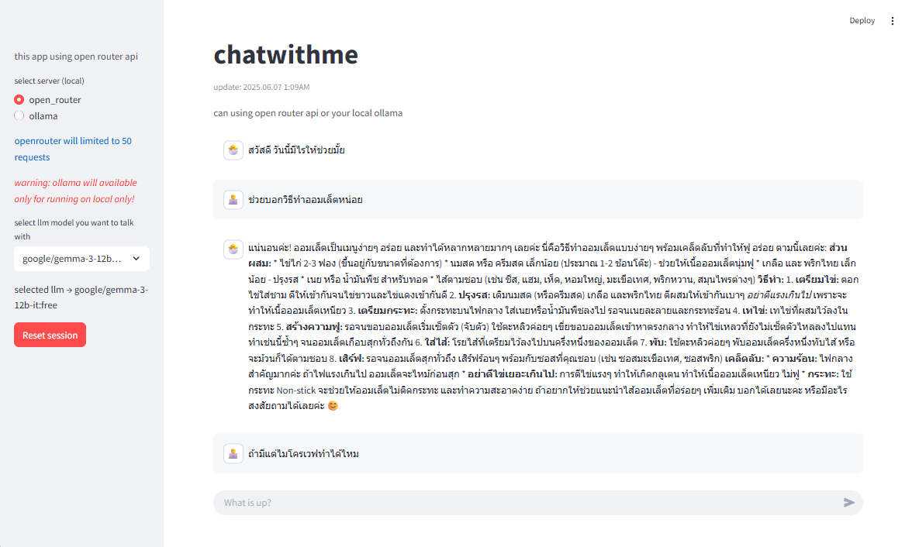

# Talk With Me 

This project is python-based mini AI chat project for testing LLM with chat interface built with streamlit. This project supports two methods for connecting to an LLM:

1. **OpenRouter** (using free tier with 50 requests per day limit)
2. **Ollama** (Local deployment only, cannot run on Streamlit Cloud)





## Features

- **Chat Interface**: Streamlit UI for easy interaction with the LLM.
- **Multiple Connection Methods**:
  - **OpenRouter**: Access via OpenRouter API with a limit of 50 requests per day.
  - **Ollama**: Local connection for running the model.


## Demo


## Requirements

- Open router API key
- Installed ollama on your device (for local test)


## To run this app
- create `secrets.toml` under `/.streamlit`
- enter your key on `secrets.toml`
```
APP_TOKEN=YOUR_APP_TOKEN
OPENROUTER_API_KEY=YOUR_OPENROUTER_API_KEY
GOOGLE_API_KEY=YOUR_GOOGLE_API_KEY
TYPHOON_AI_API_KEY=YOUR_TYPHOON_AI_API_KEY
OPENROUTER_BASE_URL="https://openrouter.ai/api/v1"
OLLAMA_HOST="http://localhost:11434"

```
- run `app.py`
```
streamlit run app.py
```

